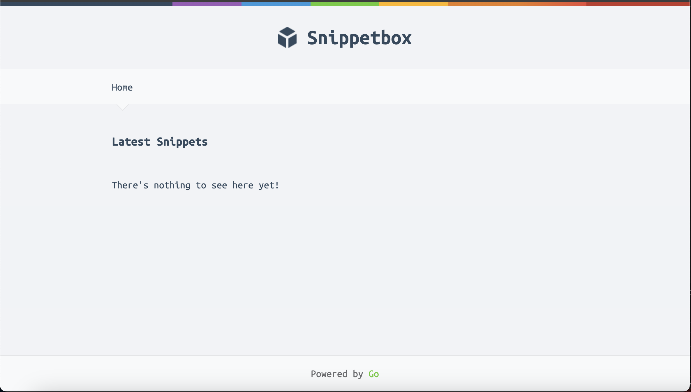

# Snippetbox

This repo holds a smaple Go-based Snippetbox application built as I followed Alex Edward's Let's Go book

## Notes

### The Internal Directory
The internal dir contains special meaning in Go: any packages which live under this dir can only be imported by code *inside the parent of the internal dir*. This means that code belongs to any packages in the internal folder can only be imported by code inside our snippetbox project. If anotyher pfoject pulls the module they cannot access it

Any packages in `internal` cannot be imported by code outside the project.

## Resources
- [The Little Go Book](https://www.openmymind.net/assets/go/go.pdf)
- [Effective Go](https://go.dev/doc/effective_go)
- [Go Project Structuring](https://go.dev/doc/modules/layout#server-project)
- [Tour of Go](https://go.dev/tour/moretypes/13)
- [How to Write Go Code](https://go.dev/doc/code)

